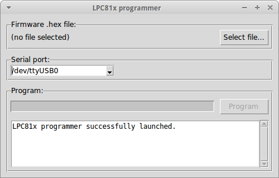

# LPC81x-ISP-TOOL - yet another NXP LPC810 / LPC811 / LPC812 / LPC832 flash tool

## Features

- GUI and command-line operation
- Erase, read, program and compare functions
- Automatically adds the required checksum to the firmware image
- Safe to use: does not allow to lock you out of ISP by default
- Info functions: reading of Part ID, UID, boot code version, etc
- Wait function: polls the LPC81x until the ISP becomes available
- Option to automatically run the firmware after flashing





## Installation

A Windows executable is in [lpc81x-isp-windows.zip](lpc81x-isp-windows-64bit.zip) so Windows users don't need to install Python and respetive modules.

Alternatively, install Python from [https://www.python.org/](https://www.python.org/).

This tool is compatible with Python 3.6+

The tool requires the following 3rd party python modules:
- pyserial
- intelhex
- tk (optional)

`tk` is required for GUI (graphical user interface] usage; but not necessary  for command line usage.


## Usage

This tool is designed for command-line usage in a makefile, but also has a simplistic GUI.

For programming a HEX file via GUI just launch the application without any command line arguments.

For programming a HEX file from the command line, use the following example:

```
lpc81x_isp.py --wait --flash <firmware.hex> --run --port <usb-to-serial>
```

If the LPC MCU is not in ISP mode yet, the tool will wait and periodically probe the chip. After flashing the firmware, it will execute it.

Run ``lcp81x_isp.py --help`` to see all available command line arguments.


## Pyinstaller info

How to build the Windows executable using [pyinstaller](https://www.pyinstaller.org/):

```
pip install pyinstaller

pyinstaller lpc81x_isp.spec
```


## Py2exe info

How to build the Windows executable using py2exe:

```
python setup.py py2exe
```

Output is in the *dist/* directory

